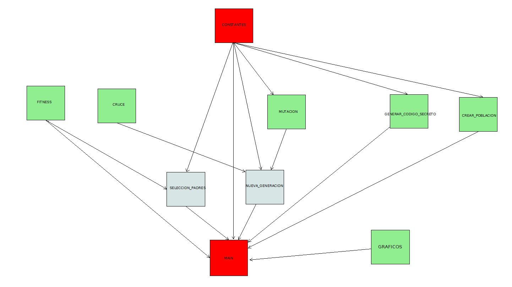
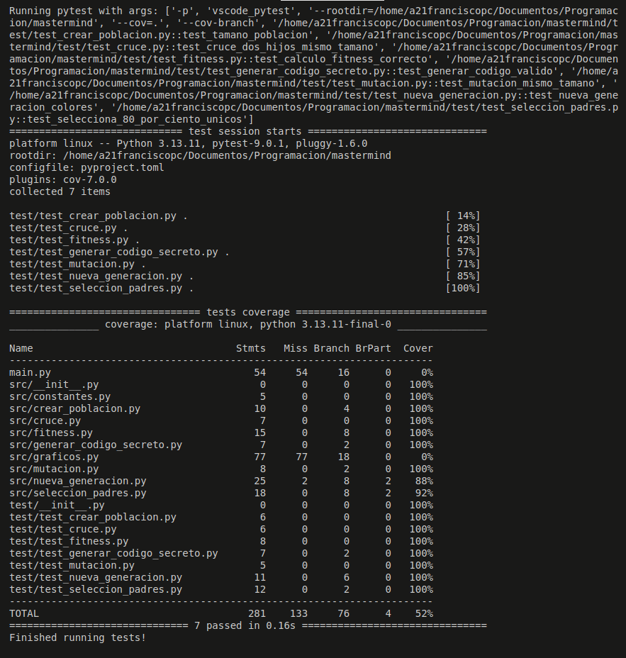
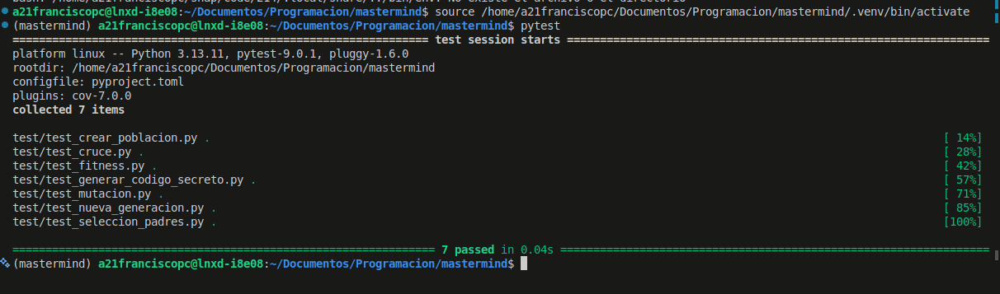
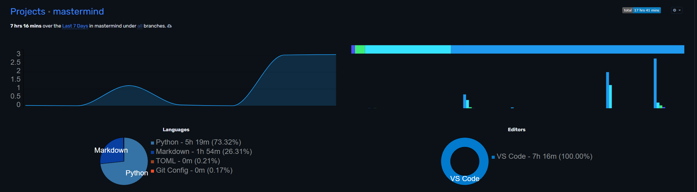
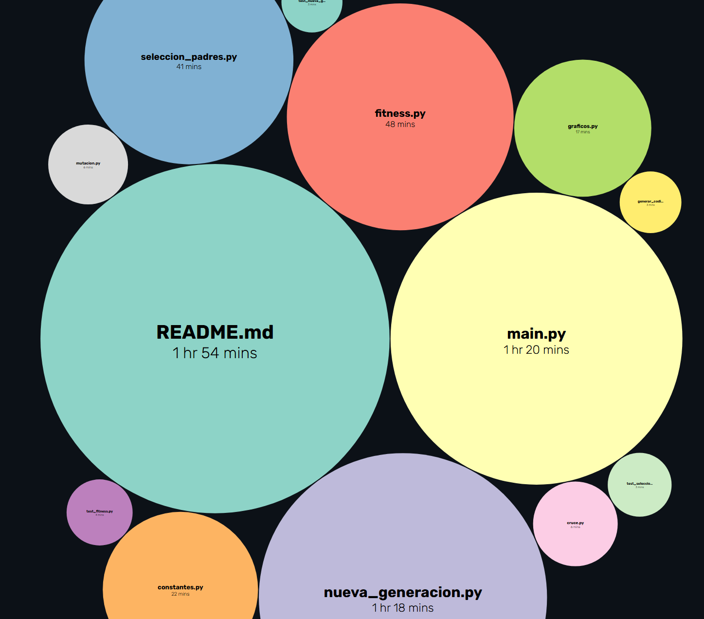

# Introducción
Sara García Garrido - [@Karyxn](https://github.com/Kayrxn)  
Francisco Pérez Cid - [@francis85a](https://github.com/francis85a)

Este proyecto se ha realizado como parte de la asignatura de Programación en el Ciclo superior de Desarrollo de Aplicaciones Multiplataforma (DAM) en el IES de Teis.

 
 

# Instalación

Para ejecutar este proyecto, asegúrate de tener Python instalado en tu sistema. Luego, clona este repositorio y navega hasta el directorio del proyecto:

`git clone https://github.com/Kayrxn/mastermind.git`  

■ Utiliza uv para crear el entorno virtual con todas las dependencias (y activarlo):  

`pip install uv`   
`uv sync` 

 
 

# 🔑Uso

Ejecuta el archivo `main.py` para iniciar el juego

 
 

# 📑Metodología

Se ha utilizado la metodología TDD (Desarrollo guiado por pruebas) para asegurar la calidad del código y facilitar el mantenimiento del proyecto. Cada funcionalidad se ha desarrollado siguiendo las historias de usuario definidas a continuación, implementando primero los casos test y luego el código necesario para que pasen (casi siempre).

Utilizamos un panel kaban para organizar las tareas y hacer seguimiento del progreso del proyecto: https://github.com/users/Kayrxn/projects/2.

 
 

# ⚙️Descripción técnica

| Not list |  |  |
|----------|----------|----------|
| **In Scope** | **Out of Scope** | **Unresolved** |
| Implementación del algoritmo genético | Interfaz gráfica avanzada | Estrategia de mutación (fija o adaptativa) |
| Generación del código secreto | Persistencia de datos | Criterio de parada (umbral de fitness) |
| Visualización en consola de los intentos | Integración automatizada | Nivel de detalle en los mensajes |
| Diseño modular | Optimización matemática avanzada | Incorporación de logs |
| Desarrollo TDD con tests unitarios | Soporte multijugador | Control de aleatoriedad |

 
 

# Historias de Usuario

## 1 – Generación del código secreto
**Como** jugador,  
**quiero** que el sistema genere un código secreto de 4 colores al inicio de la partida,  
**para** que la máquina tenga un objetivo a adivinar.  

**Criterios de aceptación:**  
- El código secreto se genera aleatoriamente de entre los colores disponibles.  
- La longitud del código es configurable (por defecto, 4).  
- El código se mantiene oculto hasta que la máquina adivine o termine la partida.  

---

## 2 – Visualizar combinaciones de la máquina
**Como** usuario,  
**quiero** ver las combinaciones que propone la máquina en cada generación,  
**para** seguir el progreso del algoritmo genético y entender cómo se acerca al código secreto.  

**Criterios de aceptación:**  
- Cada generación muestra en consola la mejor combinación propuesta y su valor de fitness.  
- Se indica el número de generación correspondiente.  

---

## 3 – Evaluación de fitness
**Como** desarrollador,  
**quiero** una función de fitness que compare cada individuo con el código secreto,  
**para** que el algoritmo genético pueda seleccionar las mejores combinaciones.  

**Criterios de aceptación:**  
- La función debe contar aciertos exactos (color y posición).  
- Debe contar aciertos de color en posición incorrecta.  
- No debe modificar los individuos ni el código original durante la evaluación.  

---

## 4 – Selección de padres
**Como** desarrollador,  
**quiero** un mecanismo de selección para elegir los mejores individuos,  
**para** que la reproducción del algoritmo genético favorezca combinaciones más cercanas al código secreto.  

**Criterios de aceptación:**  
- La mitad de la población es seleccionada en cada generación.  
- La selección se basa en el valor de fitness de los individuos.  

---

## 5 – Cruce de individuos
**Como** desarrollador,  
**quiero** una función de cruce (un punto) para generar hijos a partir de dos padres,  
**para** combinar características de individuos con buen fitness y mejorar la población.  

**Criterios de aceptación:**  
- El cruce debe devolver dos hijos.  
- Cada hijo conserva parte de cada padre según el punto de cruce.  

---

## 6 – Mutación
**Como** desarrollador,  
**quiero** una función de mutación que altere aleatoriamente un color en un individuo según una probabilidad,  
**para** mantener diversidad genética y evitar estancamiento del algoritmo.  

**Criterios de aceptación:**  
- La mutación no debe modificar la lista original del individuo.  
- El color resultante debe ser válido.  
- Todas las posiciones del individuo pueden ser mutadas eventualmente.  

---

## 7 – Ejecución del algoritmo genético
**Como** usuario,  
**quiero** que la máquina ejecute el algoritmo genético hasta adivinar el código o alcanzar el límite de generaciones,  
**para** ver el proceso completo de resolución del Mastermind.  

**Criterios de aceptación:**  
- El algoritmo se detiene si la máquina adivina el código.  
- Se muestra en consola la evolución de la población generación a generación.  
- Se informa si no se adivinó el código al alcanzar el límite de generaciones. 

 
 

# ⛓️ Diagrama de componentes

 
 

# 🔧Tecnologías utilizadas

- **Python**:

    - **Pytest**: Para pruebas unitarias y de integración.
    - **coverage**: Para medir la cobertura de las pruebas.
    - **pytest-cov**: Para generar informes de cobertura.
    - **pip**: Para la gestión de paquetes.

- **Uv**: Para la gestión de dependencias y entornos virtuales.
- **matplotlib**: Para la generación de gráficos.
- **Markdown**: Para la documentación del proyecto.
- **Git & Github**: Para el control de versiones.

 
 

# 🎚️Pruebas

Muestra del **coverage**

Muestra del **pytest**

 
 

# ⏳Análisis del tiempo invertido

La duración del proyecto ha sido de dos semanas aproximadamente. Los primeros días se utilizaron para comprender cómo llevar el algoritmo genético a desarrollo TDD, luego se repartieron los módulos entre ambos, y finalmente se trabajó en la implementación de todo el apartado gráfico.

Captura del panel - **Sara**

Captura de los módulos - **Sara**

Captura del panel - **Fran**

Captura de los módulos - **Fran**

 
 

# 🤖Uso de la IA

- ¿Qué herramienta de IA generativa usaste?

    - ChatGPT y Copilot.

- ¿Para qué usaste la herramienta?

    - Para generar un ejemplo inicial de aplicación de algoritmo genérico (con ChatGPT) que nos mostrase cómo poder dividir las responsabilidades de cada parte. No teníamos claro cómo adaptar los ejemplos proporcionados en clase al mastermind.
    - Explicaciones y ayuda con los módulos de la librería random.
    - Ayuda con el uso correcto de funciones lambda para refactorizar código.
    - Generación de casos tests.
    - Explicaciones y generación mediante Copilot del apartado gráfico.

- ¿Cómo has utilizado o cambiado la salida de la IA generativa?

    - Las salidas de copilot para refactorización no se modificaron (funciones lambda)
    - El apartado gráfico generado por copilot se cambió para diferenciarlo mejor de la estructura del algoritmo genérico en main.py, a parte de algunas correcciones menores de texto y mejor uso de nuestras constantes.
    - Aunque el ejemplo inicial de ChatGPT fue útil para entender el algoritmo, no sirvió de nada para el proyecto final.

 
 

# 🔐 Dificultades

- Comprensión del algoritmo inicial y cómo aplicarlo a TDD.
- Creación de casos test *antes* de la creación del script en sí mismo.
- Creación de los gráficos con matplotlib, incluso con ayuda de la IA.
